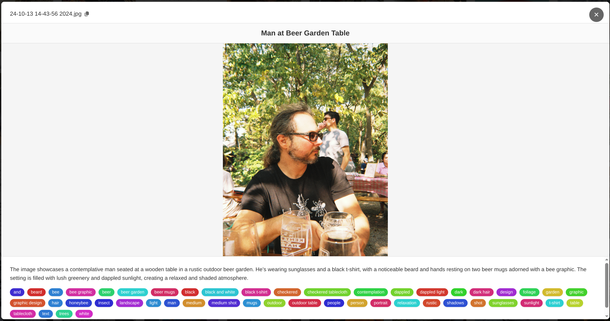

# searchable-gallery

An Electron application for browsing and searching tagged images.




## Data

The data for this application comes from [quarkus-cli-image-labeler](../quarkus-cli-image-labeler/README.md).

To populate data:

```
cd [project-dir]/quarkus-cli-image-labeler
java -jar ./build/quarkus-app/quarkus-run.jar write-tags-to-local-db [path-to-pictures]
cd [project-dir]
./copy-data-to-searchable-gallery.sh
```

In the future I will build tighter integrations.

## Running Tests

This project uses Vitest for testing. Because `better-sqlite3` is a native module, it must be compiled for either
Node.js (for tests) or Electron (for running the app).

### Before running tests

Rebuild the native module for Node.js:

```bash
npm run rebuild:test
```

### Run tests

```bash
npm test
```

Or in watch mode:

```bash
npm run test:watch
```

### Before running the Electron app

Rebuild the native module for Electron:

```bash
npm run rebuild:electron
```
